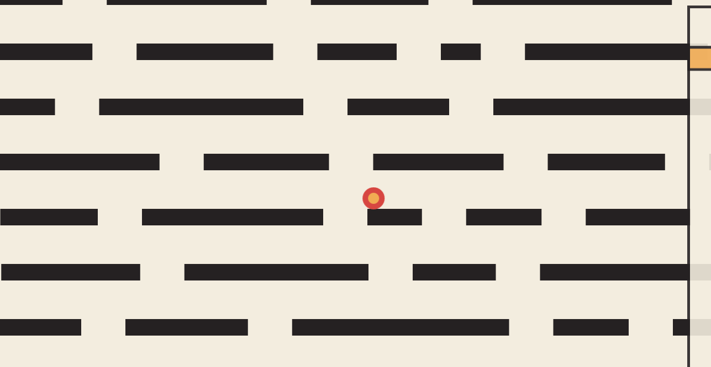

Drop
====

A game made by me, [Jonas](http://jonaslieb.com), for the ["Spielmarmelade 2015" 48h game jam](https://www.fsmpi.rwth-aachen.de/gamejam/) on 25.-26.04.2015.

The Game
--------

Goal of the game is to drop a small red ball through a level of platforms. The player can only move the next platform, one at a time, by using their mouse or touch device / tablet.

Technologies
------------

For this game the javascript/HTML5 game framework [phaser.js](https://phaser.io/) was used. The entire project was loaded and edited in the [Chrome developer tools](https://developer.chrome.com/devtools).
[The Music](media/music.mp3) is tracked from scratch using [MilkyTracker](http://milkytracker.org/). The ball sound is taken from [freesound](https://www.freesound.org/people/Spankous/sounds/245408/), where it was published by user [Spankous](https://www.freesound.org/people/Spankous/) under the [Creative Commons 0 license](http://creativecommons.org/publicdomain/zero/1.0/).

Running
-------

There are no requirements, just launch the `index.html` file in a browser.
Because of security constraints, it may be necessary to launch a web server that serves static files, the [phaser.js guide](https://phaser.io/tutorials/getting-started/part2)
proposes some lightweight servers.

There is currently a version hosted at [my webpage](http://download.jonaslieb.com/spielmarmelade-2015/), but this link is
not guaranteed to be online at all times.

