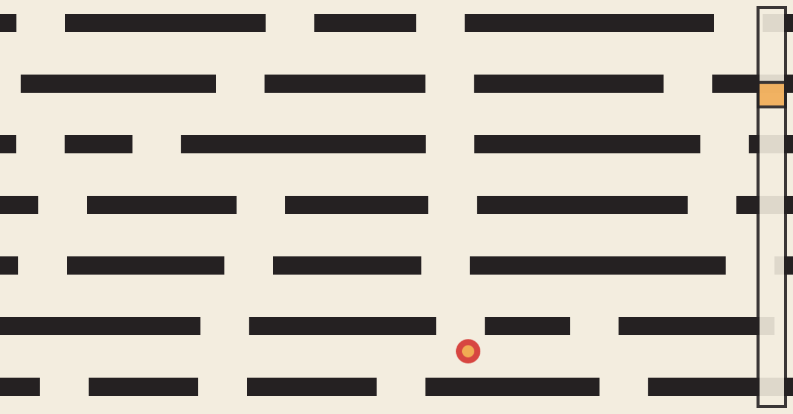

Drop
====

A game made by [Jonas Lieb](http://jonaslieb.com) on 25.-26.04.2015 at the "Spielmarmelade 2015" 48h game
jam in Aachen.

The Game
--------

Goal of the game is to drop a small red ball through a level of platforms.
The player can only move the next platform, one at a time, by using their mouse
or touch device / tablet.

Technologies
------------

For this game only the HTML5 game framework [phaser.js](https://phaser.io/) was
used. There are no requirements, just launch the `index.html` file in a browser.
Because of security constraints, it may be necessary to launch a web server that
serves static files, the [phaser.js guide](https://phaser.io/tutorials/getting-started/part2)
proposes some lightweight servers.

There is currently a version hosted at [my webpage](http://download.jonaslieb.com/spielmarmelade-2015/), but this link is
not guaranteed to be online at all times.
